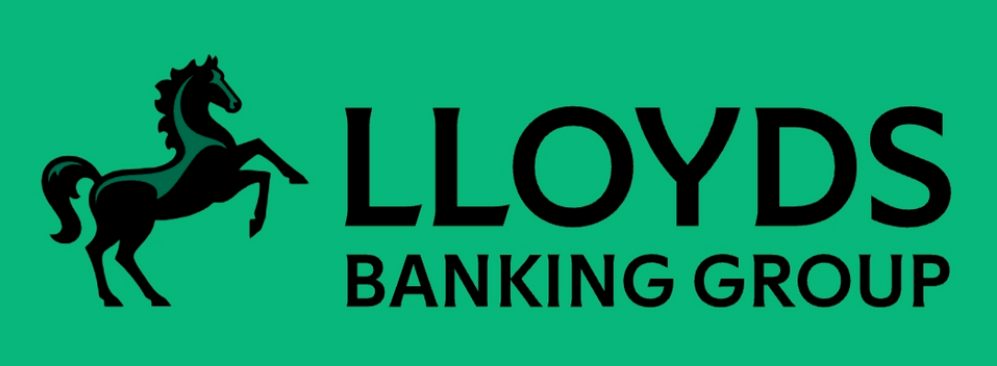
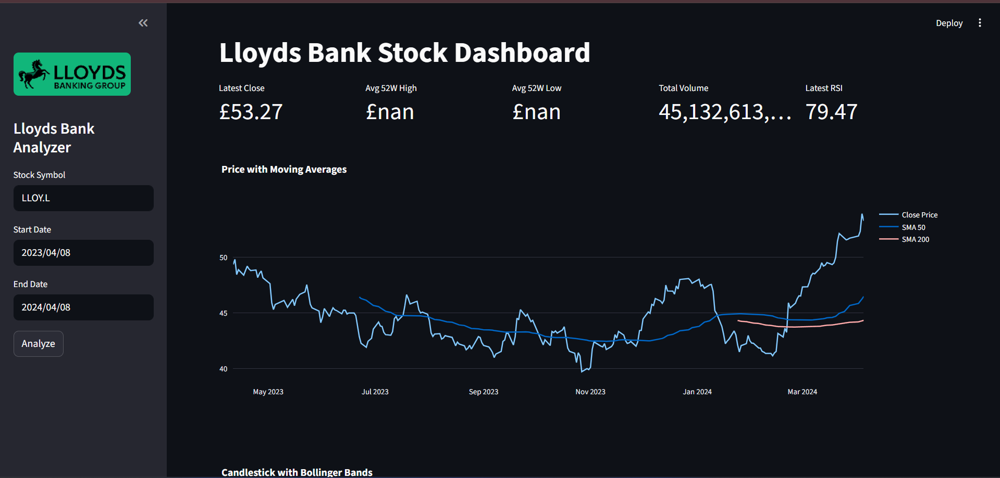
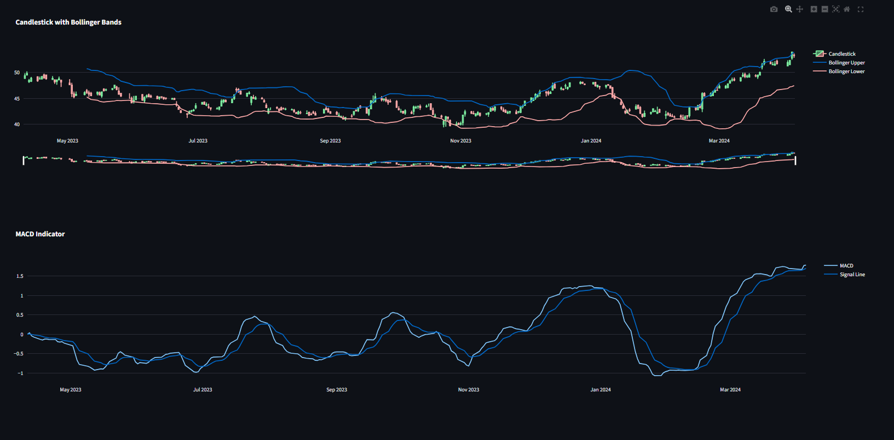

# 📊 Lloyds Bank Stock Analysis Dashboard

---



**Lloyds Bank Stock Analysis Dashboard** is a financial analytics project built using **Python** and **Streamlit** that provides real-time stock analysis for **LLOY.L (Lloyds Banking Group)**.

The dashboard integrates live financial data, technical indicators, and interactive visualizations to help investors analyze stock price trends, volatility, and market momentum for smarter investment decisions.

---

# 🖥️ Dashboard Preview

---

### Main Dashboard



### Technical Indicators Dashboard



---

# ✅ Features

---

* **Real-Time Market Data:** Automated stock data retrieval using `yfinance`.
* **Trend Detection:** Moving Average indicators (**SMA 50** and **SMA 200**) for identifying long-term market trends.
* **Volatility Monitoring:** **Bollinger Bands** help detect price expansion and contraction periods.
* **Momentum Indicators:**

  * **MACD (Moving Average Convergence Divergence)**
  * **RSI (Relative Strength Index)**
* **Interactive Visualizations:** Built using **Plotly** for zoomable and dynamic charts.
* **Financial KPIs:**

  * Latest Closing Price
  * 52-Week High and Low
  * Trading Volume
  * RSI Momentum Indicator
* **Custom Date Range Analysis:** Users can analyze stock performance within selected time periods.

---

# 🚀 Installation

---

### 1. Clone the repository

```bash
git clone https://github.com/jtp-codes/Llyods_Bank_dashboard.git
cd Llyods_Bank_dashboard
```

### 2. Install Python dependencies

```bash
pip install streamlit pandas numpy yfinance plotly requests pillow
```

### 3. Run the Streamlit application

```bash
streamlit run Lloyds_Bank_dashboard.py
```

---

# 📈 Key Insights

---

* **Trend Identification:** Moving averages smooth short-term price fluctuations and reveal the overall trend direction of Lloyds Bank stock.

* **Volatility Detection:** Bollinger Bands highlight periods when the stock may be overextended, indicating possible corrections.

* **Momentum Tracking:** RSI and MACD provide early signals of potential trend reversals and help determine whether the stock is currently **overbought** or **oversold**.

* **Interactive Exploration:** Investors can zoom into charts and analyze detailed price movements using interactive Plotly graphs.

---

# 📂 Repository Structure

---

```
Llyods_Bank_dashboard/
│
├── Lloyds_Bank_dashboard.py
├── Llyods_logo.png
├── images
│   ├── dashboard_main.png
│   ├── dashboard_indicators.png
│
└── README.md
```

---

# 🛠️ Requirements

---

* **Python 3.8+**
* **Streamlit**
* **Pandas**
* **NumPy**
* **yfinance**
* **Plotly**
* **Requests**
* **Pillow**

---

# 👥 Creator

---

* **JOEL TOM PHILIP**

---

# ⭐ Support

---

If you found this project helpful, please consider giving it a **⭐ on GitHub**.
